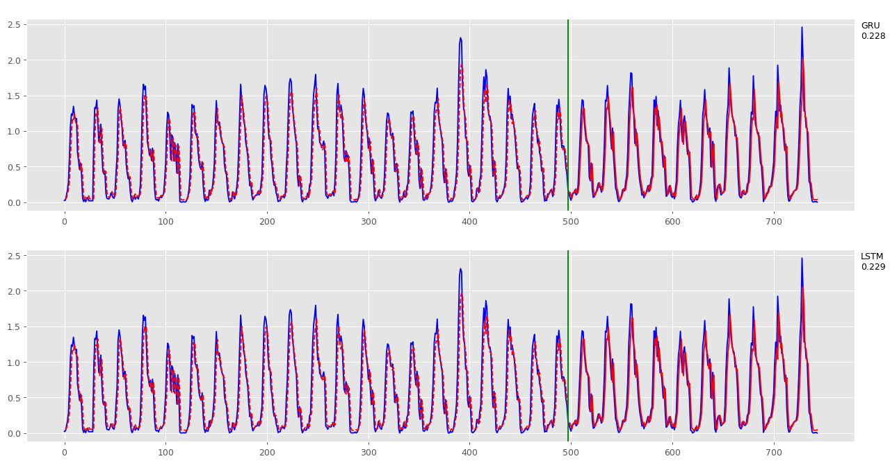

# Arquitetura para predição de séries temporais usando redes neurais: um estudo de caso com abelhas

O trabalho apresenta uma proposta de arquitetura para predição de dados de séries temporais geradas por atividades de movimentação de abelhas. O estudo de caso usa as séries temporais de um dataset disponibilizado no trabalho de [Gomes et. al. (2020)](https://doi.org/10.1038/s41598-019-56352-8) que também utilizou variáveis climáticas em seu estudo.

## Arquitetura

A arquitetura proposta utiliza dois containers em sua estrutura, um para o serviço de aplicação, chamado de "application", e outro para o serviço de banco de dados, chamado de "database".

* **application**: o container de aplicação usa a linguagem Python como base para todas as operações. Ele é responsável por buscar o dataset original, tratar os dados, fazer a inserção no banco de dados, consultar os dados inseridos, executar as redes neurais e gerar os gráficos com os resultados.

* **database**: o container de banco de dados possui o InfluxDB instalado, sendo responsável por armazenar os dados em formato de séries temporais.

A figura abaixo mostra o esquema de funcionamento da arquitetura, começando pela solicitação do dataset por meio de uma chamada HTTP [1], seguido pela obtenção dos dados em formato de séries temporais do site ResearchGate [2]. Após um tratamento nos timestamps (data e hora da atividade) os dados são inseridos no banco de dados InfluxDB [3]. Na sequência, a aplicação realiza uma consulta ao banco de dados [4] e executa duas RNNs (Redes Neurais Recorrentes), uma LSTM (Long Short-Term Memory) e uma GRU (Gated Recorrent Unit) [5]. Por fim, os resultados são mostrados em forma de gráficos disponíveis no diretório "output" [6].

## Utilização

Para utilizar a aplicação é necessário usar o comando `docker-compose up` e aguardar a configuração dos containers e a sequência de execução supracitada. Ao final da execução, será exibida a mensagem "Arquivo output/bees.png gerado com sucesso." e o arquivo fica disponível no diretório "output".

## Resultados

A figura abaixo mostra os gráficos gerados com os resultados das predições feitas pelas redes GRU e LSTM. A linha azul mostra os dados em seu formato original e a linha vermelha mostra os dados preditos. A parte tracejada representa os dados usados para treinamento das redes, separados por uma linha verde da parte contínua, que apresenta a predição executada com os dados de teste. O lado direito superior de cada gráfico indica a rede usada e o Erro Mínimo Quadrado resultante da execução nos dados de teste.

## Referências

Pedro A. B. Gomes, Yoshihiko Suhara, Patrícia Nunes-Silva, Luciano Costa, Helder Arruda, Giorgio Venturieri, Vera Lucia Imperatriz-Fonseca, Alex Pentland, Paulo de Souza, and Gustavo Pessin. **An amazon stingless bee foraging activity predicted using recurrent artificial neural networks and attribute selection**. _Scientific Reports_, 10(1):9, Jan 2020. ISSN 2045-2322. doi: [10.1038/s41598-019-56352-8](https://doi.org/10.1038/s41598-019-56352-8).
